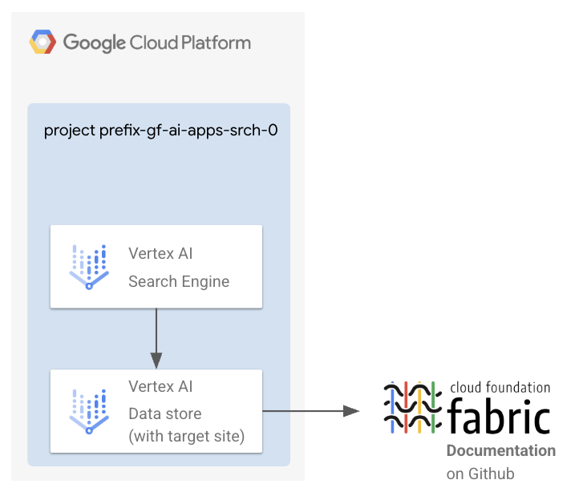

# AI Applications - Search / Platform Deployment

This stage is part of the `AI Applications - Search factory`.
It is responsible for deploying the components enabling the AI use case, either in the project you created in [0-projects](../0-projects) or in an existing project.



## Deploy the stage

This assumes you have created a project leveraging the [0-projects](../0-projects) module.

```shell
cp terraform.tfvars.sample terraform.tfvars # Customize
terraform init
terraform apply

# Follow the commands in the output.
```

## I have not used 0-projects

The [0-projects](../0-projects) stage generates the necessary Terraform input files for this stage. If you're not using the [0-projects stage](../0-projects), you'll need to manually add the required variables to your `terraform.tfvars` file, as defined in [variables.tf](./variables.tf).
<!-- BEGIN TFDOC -->
## Variables

| name | description | type | required | default |
|---|---|:---:|:---:|:---:|
| [project_config](variables.tf#L39) | The project where to create the resources. | <code title="object&#40;&#123;&#10;  id     &#61; string&#10;  number &#61; string&#10;&#125;&#41;">object&#40;&#123;&#8230;&#125;&#41;</code> | ✓ |  |
| [ai_apps_configs](variables.tf#L15) | The AI Applications configurations. | <code title="object&#40;&#123;&#10;  target_sites &#61; optional&#40;map&#40;object&#40;&#123;&#10;    provided_uri_pattern &#61; string&#10;    exact_match          &#61; optional&#40;bool, false&#41;&#10;    type                 &#61; optional&#40;string, &#34;INCLUDE&#34;&#41;&#10;    &#125;&#41;&#41;, &#123;&#10;    fabric-docs &#61; &#123;&#10;      provided_uri_pattern &#61; &#34;github.com&#47;GoogleCloudPlatform&#47;cloud-foundation-fabric&#47;&#42;&#34;&#10;    &#125;&#10;  &#125;&#41;&#10;&#125;&#41;">object&#40;&#123;&#8230;&#125;&#41;</code> |  | <code>&#123;&#125;</code> |
| [name](variables.tf#L32) | The name of the resources. This is also the project suffix if a new project is created. | <code>string</code> |  | <code>&#34;gf-ai-apps-srch-0&#34;</code> |
| [region](variables.tf#L48) | The GCP region where to deploy the resources (except data store and engine). | <code>string</code> |  | <code>&#34;europe-west1&#34;</code> |
| [region_ai_applications](variables.tf#L55) | The GCP region where to deploy the data store and the engine. | <code>string</code> |  | <code>&#34;global&#34;</code> |

## Outputs

| name | description | sensitive |
|---|---|:---:|
| [commands](outputs.tf#L20) | Command to run after the deployment. |  |
<!-- END TFDOC -->
