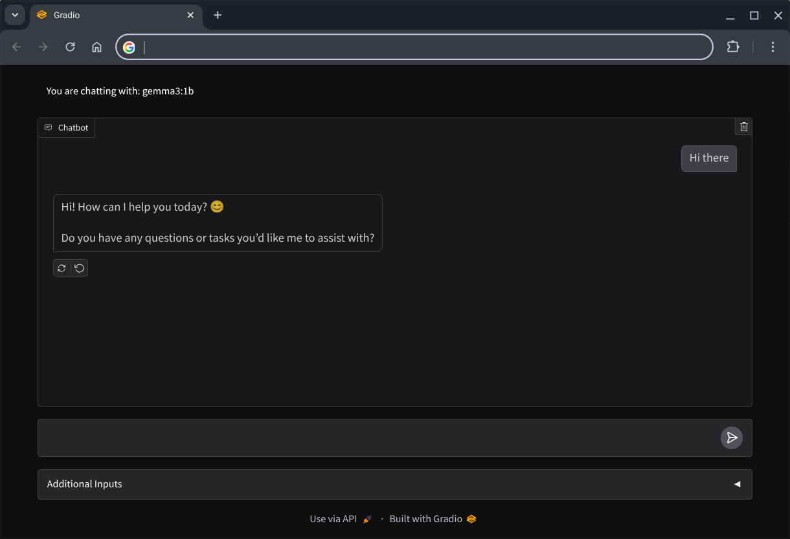

# Single Cloud GPU

The factory deploys a Cloud Run service instance with an Nvidia L4 GPU attached to run AI inference workloads.

## Application

After the [1-apps](1-apps/README.md) deployment finishes, the commands to acccess the application will be displayed on your screen.

## Core Components

The deployment includes:

- By default, a **project** with all the necessary permissions. Optionally, can use your existing project.

- An **exposure layer**, made of:
  - **Global external application load balancer** (+ Cloud Armor IP allowlist security backend policy + HTTP to HTTPS redirect + managed certificates). This is created by default.
  - **Internal application load balancer** (+ Cloud Armor IP allowlist security backend policy + HTTP to HTTPS redirect + managed certificates + CAS + Cloud DNS private zone). This is optional.

- **Cloud Run** (with Nvidia L4 GPU, authentication)

- By default, a **VPC**, a subnet and DNS policies. Optionally, can use your existing VPCs.
- By default, a **project** with all the necessary permissions. Optionally, can use your existing project.

## Apply the factory

- Enter the [0-projects](0-projects/README.md) folder and follow the instructions to setup your GCP project, service accounts and permissions
- Go to the [1-apps](1-apps/README.md) folder and follow the instructions to deploy the Cloud Run Service inside the project
