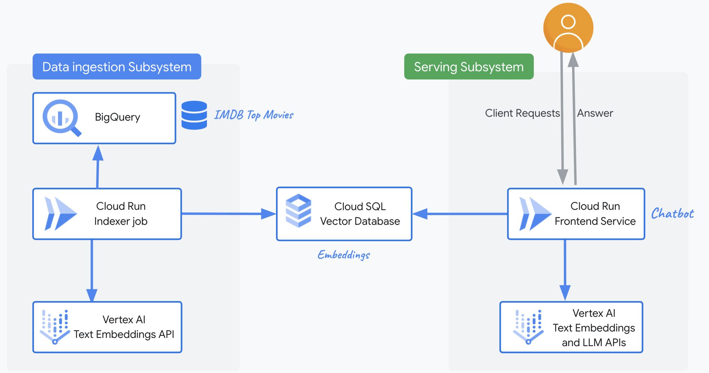

# RAG with Cloud Run

**THIS MODULE IS STILL WIP**

The module deploys a "Retrieval-Augmented Generation" (RAG) system, leveraging Cloud Run, Vertex AI, Cloud SQL and BigQuery.

A Cloud Run job periodically indexes sample [movies data](./data/top-100-imdb-movies.csv) in BigQuery, creates embeddings and stores them in a Cloud SQL database. Another Cloud Run frontend application leverages the text embeddings from the Cloud SQL database and answers questions on these movies in json format.

<p align="center">
  
</p>

The deployment includes

- An **indexer subsystem**, made of a private **Cloud Run job** with direct egress access to the user VPC, that reads sample data from **BigQuery**, leverages the **Vertex Text Embeddings APIs** and stores results in **Cloud SQL**
	
- **Databases**, specifically:
	- A **BigQuery dataset**, where users store their data to augment the model
	- A private **Cloud SQL** instance where the indexer job stores text embeddings. By default, this is PostgreSQL.

- A **frontend subsystem**, made of:
	- A **Global external application load balancer** (+ Cloud Armor IP allowlist security backend policy)
	- A private **Cloud Run** frontend with direct egress access to the user VPC, that answers user queries in json format, based on the text embeddings contained in the Cloud SQL database.

- By default, a **VPC**, a subnet, private Google APIs routes and DNS policies. Optionally, can use your existing VPCs.
- By default, a **project** with all the necessary permissions. Optionally, can use your existing project.

## Deployment

```shell
# Create terraform.tfvars
cp terraform.tfvars.sample terraform.tfvars

# Customize it with your billing account and parent

# Initialize Terraform and deploy
terraform init
terraform apply

# Deploy the application: follow the commands in the output screen to deploy the application(s).
```
<!-- BEGIN TFDOC -->
## Variables

| name | description | type | required | default |
|---|---|:---:|:---:|:---:|
| [project_config](variables.tf#L114) | The project configuration. Billing id and parent are mandatory if  | <code title="object&#40;&#123;&#10;  billing_account_id &#61; optional&#40;string&#41;     &#35; if create or control equals true&#10;  control            &#61; optional&#40;bool, true&#41; &#35; control an existing project&#10;  create             &#61; optional&#40;bool, true&#41; &#35; create and control project&#10;  parent             &#61; optional&#40;string&#41;     &#35; if control equals true&#10;&#125;&#41;">object&#40;&#123;&#8230;&#125;&#41;</code> | ✓ |  |
| [allowed_ip_ranges](variables.tf#L15) | The ip ranges that can call the Cloud Run service. | <code>list&#40;string&#41;</code> |  | <code>&#91;&#34;0.0.0.0&#47;0&#34;&#93;</code> |
| [cloud_run_configs](variables.tf#L22) | The Cloud Run configurations. | <code title="object&#40;&#123;&#10;  frontend &#61; object&#40;&#123;&#10;    containers &#61; optional&#40;map&#40;any&#41;, &#123;&#10;      frontend &#61; &#123;&#10;        image &#61; &#34;us-docker.pkg.dev&#47;cloudrun&#47;container&#47;hello&#34;&#10;      &#125;&#10;    &#125;&#41;&#10;    deletion_protection &#61; optional&#40;bool, true&#41;&#10;    ingress             &#61; optional&#40;string, &#34;INGRESS_TRAFFIC_INTERNAL_LOAD_BALANCER&#34;&#41;&#10;    max_instance_count  &#61; optional&#40;number, 3&#41;&#10;    service_invokers    &#61; optional&#40;list&#40;string&#41;, &#91;&#93;&#41;&#10;    vpc_access_egress   &#61; optional&#40;string, &#34;ALL_TRAFFIC&#34;&#41;&#10;    vpc_access_tags     &#61; optional&#40;list&#40;string&#41;, &#91;&#93;&#41;&#10;  &#125;&#41;&#10;  ingestion &#61; object&#40;&#123;&#10;    containers &#61; optional&#40;map&#40;any&#41;, &#123;&#10;      ingestion &#61; &#123;&#10;        image &#61; &#34;us-docker.pkg.dev&#47;cloudrun&#47;container&#47;hello&#34;&#10;      &#125;&#10;    &#125;&#41;&#10;    deletion_protection &#61; optional&#40;bool, true&#41;&#10;    ingress             &#61; optional&#40;string, &#34;INGRESS_TRAFFIC_INTERNAL_ONLY&#34;&#41;&#10;    max_instance_count  &#61; optional&#40;number, 3&#41;&#10;    service_invokers    &#61; optional&#40;list&#40;string&#41;, &#91;&#93;&#41;&#10;    vpc_access_egress   &#61; optional&#40;string, &#34;ALL_TRAFFIC&#34;&#41;&#10;    vpc_access_tags     &#61; optional&#40;list&#40;string&#41;, &#91;&#93;&#41;&#10;  &#125;&#41;&#10;&#125;&#41;">object&#40;&#123;&#8230;&#125;&#41;</code> |  | <code title="&#123;&#10;  frontend  &#61; &#123;&#125;&#10;  ingestion &#61; &#123;&#125;&#10;&#125;">&#123;&#8230;&#125;</code> |
| [db_configs](variables.tf#L59) | The Cloud SQL configurations. | <code title="object&#40;&#123;&#10;  availability_type &#61; optional&#40;string, &#34;REGIONAL&#34;&#41;&#10;  database_version  &#61; optional&#40;string, &#34;POSTGRES_14&#34;&#41;&#10;  flags             &#61; optional&#40;map&#40;string&#41;, &#123; &#34;cloudsql.iam_authentication&#34; &#61; &#34;on&#34; &#125;&#41;&#10;  tier              &#61; optional&#40;string, &#34;db-f1-micro&#34;&#41;&#10;&#125;&#41;">object&#40;&#123;&#8230;&#125;&#41;</code> |  | <code>&#123;&#125;</code> |
| [enable_deletion_protection](variables.tf#L71) | Whether deletion protection should be enabled. | <code>bool</code> |  | <code>true</code> |
| [ingestion_schedule_configs](variables.tf#L78) | The configuration of the Cloud Scheduler that calls invokes the Cloud Run ingestion job. | <code title="object&#40;&#123;&#10;  attempt_deadline &#61; optional&#40;string, &#34;60s&#34;&#41;&#10;  retry_count      &#61; optional&#40;number, 3&#41;&#10;  schedule         &#61; optional&#40;string, &#34;&#42;&#47;30 &#42; &#42; &#42; &#42;&#34;&#41;&#10;&#125;&#41;">object&#40;&#123;&#8230;&#125;&#41;</code> |  | <code>&#123;&#125;</code> |
| [ip_address](variables.tf#L89) | The optional load balancer IP address. If not specified, the module will create one. | <code>string</code> |  | <code>null</code> |
| [name](variables.tf#L95) | The name of the resources. This is also the project suffix if a new project is created. | <code>string</code> |  | <code>&#34;gf-rrag-0&#34;</code> |
| [networking_config](variables.tf#L102) | The networking configuration. | <code title="object&#40;&#123;&#10;  create      &#61; optional&#40;bool, true&#41;&#10;  subnet_cidr &#61; optional&#40;string, &#34;10.0.0.0&#47;24&#34;&#41;&#10;  subnet_id   &#61; optional&#40;string, &#34;sub-0&#34;&#41;&#10;  vpc_id      &#61; optional&#40;string, &#34;net-0&#34;&#41;&#10;&#125;&#41;">object&#40;&#123;&#8230;&#125;&#41;</code> |  | <code>&#123;&#125;</code> |
| [prefix](variables.tf#L132) | The prefix to use for projects and GCS buckets. | <code>string</code> |  | <code>null</code> |
| [public_domains](variables.tf#L138) | The list of domains connected to the public load balancer. | <code>list&#40;string&#41;</code> |  | <code>&#91;&#34;example.com&#34;&#93;</code> |
| [region](variables.tf#L145) | The GCP region where to deploy the resources. | <code>string</code> |  | <code>&#34;europe-west1&#34;</code> |

## Outputs

| name | description | sensitive |
|---|---|:---:|
| [commands](outputs.tf#L36) | Run the following commands when the deployment completes to deploy the app. |  |
| [ip_address](outputs.tf#L94) | The load balancer IP address of the frontend. |  |
<!-- END TFDOC -->
