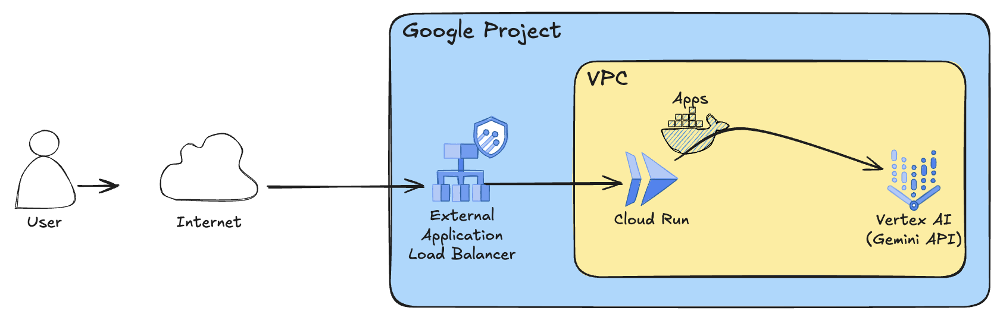

# Cloud Run - single / Application Deployment

This module is part of the Single Cloud Run factory and is responsible for deploying the required infrastructure in an existing project, or one managed by the [0-projects](../0-projects) module.

It leverages the Google Cloud Run service to allow for the deployment of a containerized application and an External Application Load Balancer to expose them publicly.

Once ran, the terraform module prints the commands required to deploy the application to Cloud Run as `gcloud` commands.

## Deployed Architecture

This module deploys and configures the following core components:

- **Google Cloud Run Service:** Where to deploy containerized applications.
- **Google Cloud Load Balancer:** A global external HTTP(S) load balancer to route traffic to the Cloud Run services.
- **Serverless NEG:** A Serverless Network Endpoint Group to connect the load balancer to the Cloud Run services.
- **VPC:** Optionally sets up a VPC, used for Private Google Access.
- **VPC Direct Egress:** Sets up VPC direct egress for Cloud Run services to access the Google APIs via PGA in a VPC network.

## Configurations

Key configurations include:

- `cloud_run_configs`: Defines the configurations for the Cloud Run services, including container images, ingress settings, instance counts, and VPC access.
- `networking_config`: Configures the networking setup, including VPC and subnet creation or referencing existing ones.
- `allowed_ip_ranges`: Specifies the IP ranges allowed to access the Cloud Run service.
- `public_domains`: Lists the domains connected to the public load balancer.

## Applications

- [Chat App](./apps/chat/README.md): A simple chat application deployed on Cloud Run.

<!-- BEGIN TFDOC -->
## Variables

| name | description | type | required | default |
|---|---|:---:|:---:|:---:|
| [project_config](variables.tf#L102) | The project where to create the resources. | <code title="object&#40;&#123;&#10;  id     &#61; string&#10;  number &#61; string&#10;&#125;&#41;">object&#40;&#123;&#8230;&#125;&#41;</code> | ✓ |  |
| [ca_pool_name_suffix](variables.tf#L18) | The name suffix of the CA pool used for app ILB certificates. | <code>string</code> |  | <code>&#34;ca-pool-0&#34;</code> |
| [cloud_run_configs](variables.tf#L25) | The Cloud Run configurations. | <code title="object&#40;&#123;&#10;  containers &#61; optional&#40;map&#40;any&#41;, &#123;&#10;    ai &#61; &#123;&#10;      image &#61; &#34;us-docker.pkg.dev&#47;cloudrun&#47;container&#47;hello&#34;&#10;    &#125;&#10;  &#125;&#41;&#10;  ingress            &#61; optional&#40;string, &#34;INGRESS_TRAFFIC_INTERNAL_LOAD_BALANCER&#34;&#41;&#10;  max_instance_count &#61; optional&#40;number, 3&#41;&#10;  service_invokers   &#61; optional&#40;list&#40;string&#41;, &#91;&#93;&#41;&#10;  vpc_access_egress  &#61; optional&#40;string, &#34;ALL_TRAFFIC&#34;&#41;&#10;  vpc_access_tags    &#61; optional&#40;list&#40;string&#41;, &#91;&#93;&#41;&#10;&#125;&#41;">object&#40;&#123;&#8230;&#125;&#41;</code> |  | <code>&#123;&#125;</code> |
| [enable_deletion_protection](variables.tf#L43) | Whether deletion protection should be enabled. | <code>bool</code> |  | <code>true</code> |
| [lbs_config](variables.tf#L50) | The load balancers configuration. | <code title="object&#40;&#123;&#10;  external &#61; object&#40;&#123;&#10;    enable &#61; optional&#40;bool, true&#41;&#10;    ip_address        &#61; optional&#40;string&#41;&#10;    domain            &#61; optional&#40;string, &#34;example.com&#34;&#41;&#10;    allowed_ip_ranges &#61; optional&#40;list&#40;string&#41;, &#91;&#34;0.0.0.0&#47;0&#34;&#93;&#41;&#10;  &#125;&#41;&#10;  internal &#61; object&#40;&#123;&#10;    enable &#61; optional&#40;bool, false&#41;&#10;    ip_address        &#61; optional&#40;string&#41;&#10;    domain            &#61; optional&#40;string, &#34;example.com&#34;&#41;&#10;    allowed_ip_ranges &#61; optional&#40;list&#40;string&#41;, &#91;&#34;0.0.0.0&#47;0&#34;&#93;&#41;&#10;  &#125;&#41;&#10;&#125;&#41;">object&#40;&#123;&#8230;&#125;&#41;</code> |  | <code title="&#123;&#10;  external &#61; &#123;&#125;&#10;  internal &#61; &#123;&#125;&#10;&#125;">&#123;&#8230;&#125;</code> |
| [name](variables.tf#L77) | The name of the resources. This is also the project suffix if a new project is created. | <code>string</code> |  | <code>&#34;gf-srun-0&#34;</code> |
| [networking_config](variables.tf#L84) | The networking configuration. | <code title="object&#40;&#123;&#10;  create &#61; optional&#40;bool, true&#41;&#10;  vpc_id &#61; optional&#40;string, &#34;net-0&#34;&#41;&#10;  subnet &#61; optional&#40;object&#40;&#123;&#10;    ip_cidr_range &#61; optional&#40;string, &#34;10.0.0.0&#47;24&#34;&#41;&#10;    name          &#61; optional&#40;string, &#34;sub-0&#34;&#41;&#10;  &#125;&#41;, &#123;&#125;&#41;&#10;  subnet_proxy_only &#61; optional&#40;object&#40;&#123;&#10;    ip_cidr_range &#61; optional&#40;string, &#34;10.20.0.0&#47;24&#34;&#41;&#10;    name          &#61; optional&#40;string, &#34;proxy-only-sub-0&#34;&#41;&#10;  &#125;&#41;, &#123;&#125;&#41;&#10;&#125;&#41;">object&#40;&#123;&#8230;&#125;&#41;</code> |  | <code>&#123;&#125;</code> |
| [region](variables.tf#L111) | The GCP region where to deploy the resources. | <code>string</code> |  | <code>&#34;europe-west1&#34;</code> |
| [service_accounts](variables.tf#L118) | The pre-created service accounts used by the blueprint. | <code title="map&#40;object&#40;&#123;&#10;  email     &#61; string&#10;  iam_email &#61; string&#10;  id        &#61; string&#10;&#125;&#41;&#41;">map&#40;object&#40;&#123;&#8230;&#125;&#41;&#41;</code> |  | <code>&#123;&#125;</code> |

## Outputs

| name | description | sensitive |
|---|---|:---:|
| [commands](outputs.tf#L15) | Run the following commands when the deployment completes to deploy the app. |  |
| [ip_addresses](outputs.tf#L32) | The load balancers IP addresses. |  |
<!-- END TFDOC -->
