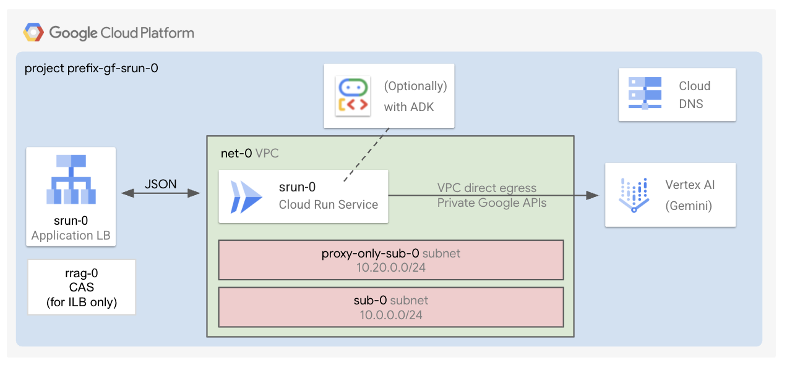

# Single Cloud Run

The factory deploys a secure Cloud Run instance to run AI applications.

## Applications

After the [1-apps](1-apps/README.md) deployment finishes, the commands to deploy the applications will be displayed on your screen.

Cloud run single allows deploying these applications:

- **Chat:** a secure backend exposing a JSON interface to communicate with Gemini through Vertex APIs.
- **ADK:** a sample, secure [Agent Development Kit (ADK) deployment](https://google.github.io/adk-docs/deploy/cloud-run/).
- **Gemma:** a sample deployment of Gemma 3 using Cloud Run GPUs.

## Core Components

The deployment includes:

- An **exposure layer**, made of:
  - **Global external application load balancer** (+ Cloud Armor IP allowlist security backend policy + HTTP to HTTPS redirect + managed certificates). This is created by default.
  - **Internal application load balancer** (+ Cloud Armor IP allowlist security backend policy + HTTP to HTTPS redirect + managed certificates + CAS + Cloud DNS private zone). This is optional.

- **Cloud Run** (with authentication and direct VPC egress)

- By default, a **VPC**, a subnet, private Google APIs routes and DNS policies. Optionally, can use your existing VPCs.
- By default, a **project** with all the necessary permissions. Optionally, can use your existing project.

## Apply the factory

- Enter the [0-projects](0-projects/README.md) folder and follow the instructions to setup your GCP project, service accounts and permissions
- Go to the [1-apps](1-apps/README.md) folder and follow the instructions to deploy the components inside the project
